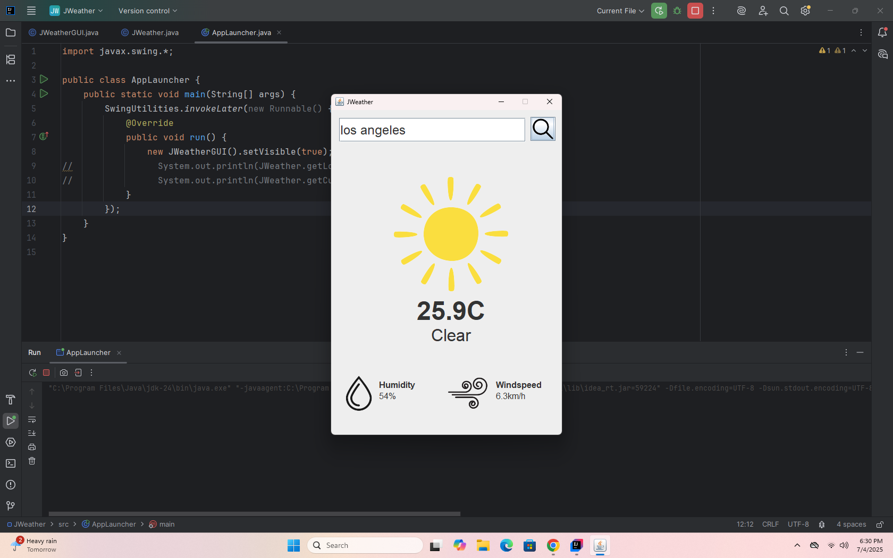
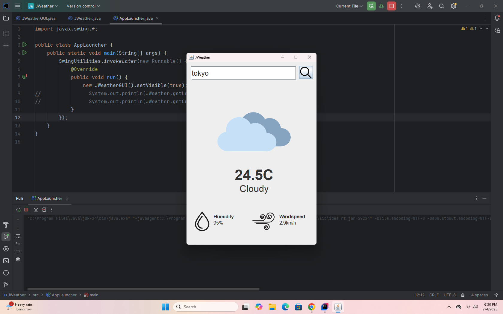

# ☁️ JWeather

**JWeather** is a sleek and lightweight desktop weather app built using **Java Swing** and **AWT**. It fetches real-time weather data from the [Open‑Meteo API](https://open-meteo.com/) and displays it in a clean, user-friendly interface. Perfect for quickly checking temperature, humidity, and forecasts right from your desktop.

---

## ⚙️ Features

- 🌤️ Displays current weather conditions (temperature, humidity, wind speed)
- 🌇 Search by city name
- 🖥️ Intuitive Java Swing-based GUI
- 🌍 Powered by Open‑Meteo API (no API key needed!)

---

## 📸 Screenshots

  
*Clean layout with weather data*

  
*Search city feature in action*

---

## 🚀 Getting Started

### Requirements

- Java JDK 8 or higher  
- Internet connection to fetch API data

---

### 🔧 Build & Run

1. **Clone the repository**
   ```bash
   git clone https://github.com/AshmitDas19/JWeather.git
   cd JWeather
   ```

2. **Compile the project**
   ```bash
   javac -cp src src/AppLauncher.java
   ```

3. **Run the application**
   ```bash
   java -cp src AppLauncher
   ```

---

## ❓ FAQ

**Q: Does JWeather need an API key?**  
A: No, it uses Open-Meteo API which doesn't require authentication.

**Q: Can I change temperature units?**  
A: Not yet—but support for °F is planned in future updates.

**Q: Is this cross-platform?**  
A: Yes! Works on Windows, macOS, and Linux with Java installed.

**Q: Can I contribute?**  
A: Absolutely! See the [Contributing](#-contributing) section below.

---

## 🤝 Contributing

Want to help improve JWeather?

1. Fork the repo  
2. Create a branch: `git checkout -b feature-name`  
3. Commit your changes  
4. Push and open a pull request

---

## 📜 License

Licensed under the [MIT License](LICENSE).

---

## 💬 Contact

Got feedback or ideas?  
Open an [issue](https://github.com/AshmitDas19/JWeather/issues) or start a discussion.  
Built with Java ❤️ and clouds.
